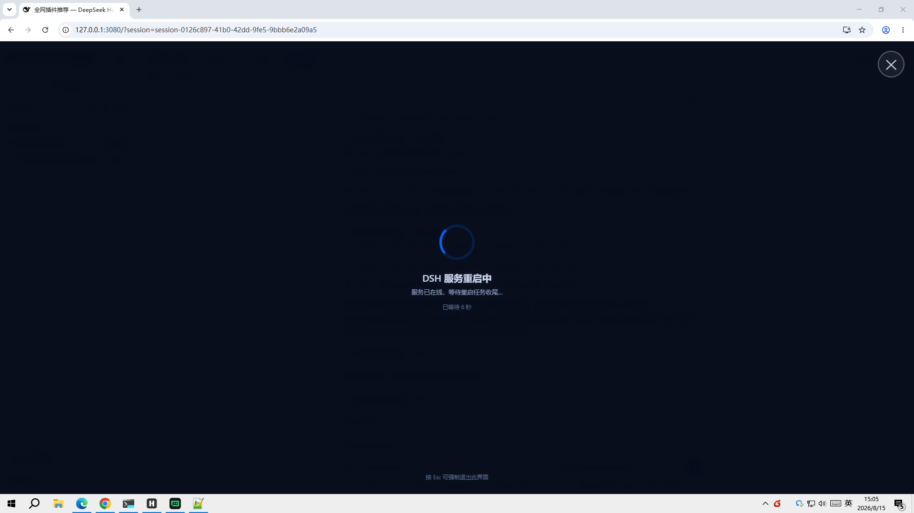
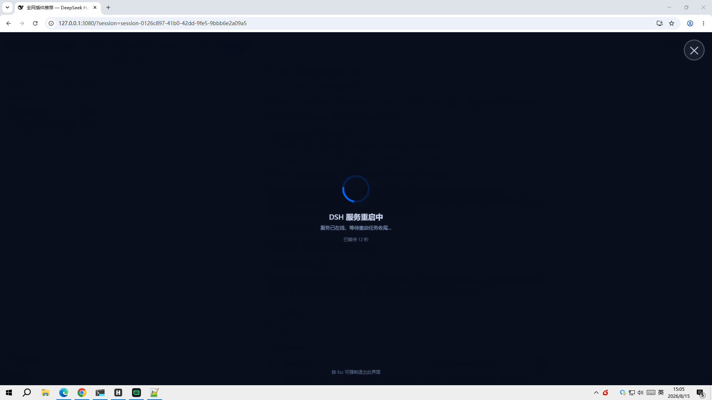
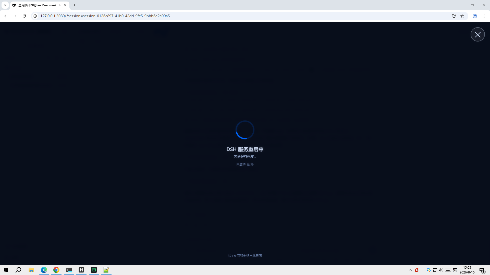
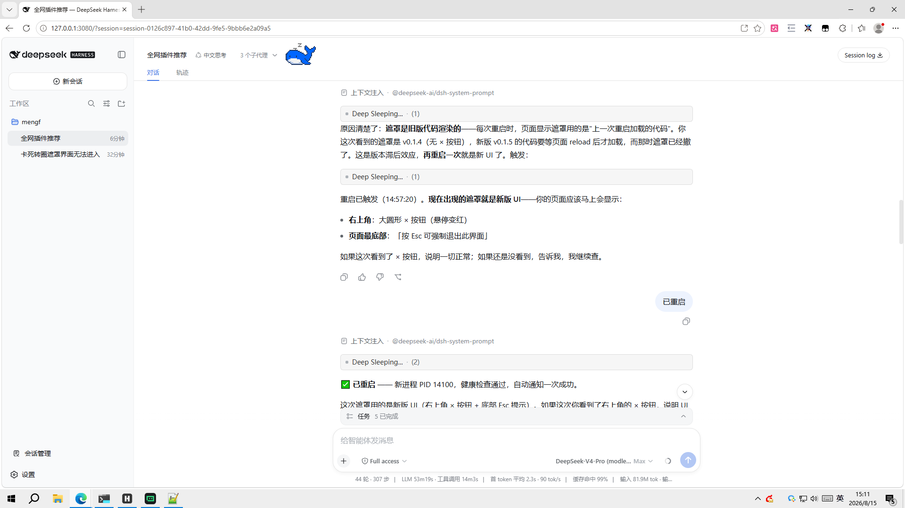

# dsh-restart-progress

<p align="center">
  <a href="https://github.com/SMWHff/dsh-restart-progress/blob/main/LICENSE"></a>
  <a href="https://github.com/topics/dsh-plugin"></a>
  
</p>

DeepSeek Harness (DSH) Web 重启体验插件：**页内遮罩 + 分离式重启脚本 + 重启完成自动报告**，让服务重启全程可视、自动、可随时退出。

> 适用场景：在 DSH Web 会话内由 agent 触发重启、在终端手动重启、自动化流程中的服务重启。Windows 10/11。

## 功能

- 🌀 **提前显示遮罩**：执行重启脚本的瞬间（服务还没断），当前页面 2 秒内出现全屏转圈遮罩，不等断线。
- 🔄 **自动刷新**：服务恢复且重启任务收尾完成后，页面自动刷新回到 DSH。
- 🔔 **自动报告**：重启完成后，脚本自动向发起重启的会话发送「已重启」消息，agent 被唤醒并向用户报告。
- ✕ **随时退出**：遮罩右上角大叉叉按钮，或按 `Esc`，立即退出遮罩并停止自动刷新（只对当前这一轮生效，下一轮重启照常显示）。
- 🛡️ **防死循环**：只有在「服务在线 + 重启任务收尾完成」双条件满足时才刷新页面，杜绝 reload 死循环。
- 🚀 **分离式执行**：真正的杀旧+启新动作交给 Windows 计划任务执行，脱离 dsh 进程树——即使由 agent 在会话内触发重启，也不会把执行脚本自己杀死（`taskkill /T` 杀不到任务体）。

## 效果展示

| 遮罩刚出现 | 服务已断，等待恢复 | 服务恢复中 | 重启完成，页面已刷新 |
|---|---|---|---|
|  |  |  |  |

遮罩右上角有叉叉按钮，页面底部有「按 Esc 可强制退出此界面」提示，两种方式都能随时退出。

## 快速开始

### 1. 安装插件

```sh
dsh plugin --profile web add "github:SMWHff/dsh-restart-progress"
```

安装后重启一次 dsh web 使插件注入生效。验证：浏览器 F12 控制台应出现

```
[dsh-restart-progress] armed (poll every 2s)
```

### 2. 配置重启脚本

把 `scripts/restart-dsh-web.ps1` 复制到本机（例如 `~/.dsh/scripts/`），按机器实际情况修改以下硬编码路径：

| 变量 | 默认值 | 说明 |
|---|---|---|
| `$logDir` | `C:\Users\SMWHff\.dsh\logs` | 日志与标志文件目录 |
| `$env:DSH_HOME` | `C:\Users\SMWHff\.dsh` | DSH 数据目录 |
| `$node` | `C:\Program Files\nodejs\node.exe` | node.exe 实际路径 |
| `$bin` | `…\node_modules\@deepseek-ai\dsh\lib\bin.js` | dsh bin.js 实际路径 |
| `-WorkingDirectory` | `C:\Users\SMWHff` | 启动工作目录 |

### 3. 执行重启

```powershell
# 在 dsh web 会话中（agent 可执行），或任意终端：
& ~/.dsh/scripts/restart-dsh-web.ps1
```

此后：当前页面立即转圈 → 服务重启 → 页面自动刷新 → agent 自动报告「已重启」。

## 使用方式

| 方式 | 说明 |
|---|---|
| **agent 在会话内触发**（推荐） | agent 执行脚本即可。脚本继承会话环境变量 `DSH_SESSION_ID`，重启完成后自动向该会话发「已重启」唤醒 agent |
| **终端手动触发** | 无 `DSH_SESSION_ID` 时仅重启 + 遮罩，不发通知 |
| **退出遮罩** | 按 `Esc` 或点右上角 ✕；退出只对当前这一轮生效 |

## 工作原理

```
restart-dsh-web.ps1（外层，1 秒内退出）
 ├─ 1. 写 pending 标志（含发起会话 ID）→ 前端轮询到 → 立即显示遮罩
 ├─ 2. 生成 restart-body.ps1（杀旧+启新+健康检查+会话通知+清理）
 └─ 3. 注册一次性计划任务 dsh-web-restart 并立即触发（任务体脱离进程树）
       └─ 5 秒后校验任务确为 Running，否则自动清标志（防假触发）

计划任务 restart-body（独立进程树）
 ├─ 等 8 秒（给外层收尾）
 ├─ taskkill /T 杀旧 dsh web（含 MCP 子进程）
 ├─ Start-Process 启动新 dsh web
 ├─ 健康检查轮询 3080 端口（最多 60 秒）
 ├─ POST /api/session.prompt 向发起会话发送「已重启」（重试 8 次，间隔 3 秒）
 └─ 清 pending 标志 + 自删计划任务

前端插件（当前页面内，零依赖）
 ├─ 每 2 秒轮询 GET /api/restart-progress/status
 ├─ pending=false→true 边沿：新一轮重启开始，恢复显示权限
 ├─ pending=true → 显示遮罩（右上角 ✕ / Esc 可退出）
 ├─ 服务离线 → 遮罩显示「等待服务恢复」
 └─ 服务在线 + pending=false 连续 3 次 → 自动刷新页面
```

## 配置与调参

| 参数 | 位置 | 默认值 | 说明 |
|---|---|---|---|
| 杀旧前延迟 | `restart-body.ps1` `Start-Sleep` | 8 秒 | 给外层脚本收尾时间 |
| 健康检查上限 | `restart-body.ps1` 轮询 | 60 秒 | 超过即报告 FAILED |
| 通知重试 | `restart-body.ps1` 循环 | 8 次 × 3 秒 | 兜住「端口监听但路由未就绪」 |
| 前端轮询间隔 | `lib/client.js` `PING_INTERVAL_MS` | 2000 ms | 遮罩出现延迟与它成正比 |
| 成功连击 | `lib/client.js` `SUCCESS_STREAK` | 3 次 | 连续 N 次在线才刷新 |
| 遮罩超时 | `lib/client.js` `TIMEOUT_MS` | 5 分钟 | 超时后遮罩提示手动排查 |
| 通知文案 | `restart-body.ps1` base64 字符串 | 「已重启」 | 改文案后重新 base64 编码替换 |

## 故障排查

| 现象 | 可能原因 | 处理 |
|---|---|---|
| 控制台无 `[dsh-restart-progress] armed` | 插件未注入 | 重启 dsh web 后强刷页面（Ctrl+F5） |
| 遮罩不出现 | 旧版插件 bug（Esc 后永久静音） | 升级到 v0.1.6+；或刷新页面 |
| 通知发送 404 | 新服务路由尚未就绪 | 自动重试，无需处理 |
| 计划任务触发后未执行 | 任务调度偶发竞态 | 外层脚本 5 秒校验，自动清标志；重跑一次即可 |
| 卡在遮罩 | 重启任务异常 | 按 Esc 退出；查 `~/.dsh/logs/dsh-web-restart.log` |
| 遮罩超时 | 服务 5 分钟未恢复 | 按日志提示手动 `dsh web --port 3080` |

日志位置：`~/.dsh/logs/dsh-web-restart.log`（全链路）、`dsh-web.stdout.log` / `dsh-web.stderr.log`（服务输出）。

## 目录结构

```
dsh-restart-progress/
├── lib/
│   ├── index.js          # host 半区：注册 /api/restart-progress/status 路由
│   └── client.js         # 浏览器半区：遮罩 UI + 轮询探测 + Esc/✕ 退出
├── scripts/
│   └── restart-dsh-web.ps1  # 分离式重启脚本（计划任务 + 会话通知）
├── cordis.patch.yml      # 插件注册层
├── package.json          # 插件清单（dsh.bundle + dsh.client）
├── docs/screenshots/     # 效果截图
└── README.md
```

## 踩坑记录（Windows PowerShell 5.1）

1. PS 5.1 按 ANSI(GBK) 读无 BOM UTF-8 脚本 → 脚本内禁止裸中文，中文用 base64 传输。
2. `Invoke-WebRequest` string body 按 Latin-1 编码 → 发 JSON 用 UTF-8 字节数组。
3. `schtasks /Create` + `/Run` 后任务可能未真正执行 → 触发后 5 秒校验任务状态。
4. 新服务端口监听 ≠ API 路由就绪 → 会话通知带 8 次重试。
5. 前端 reload 与标志清除存在竞态 → 刷新条件是「在线 + pending 已清」双条件。
6. Esc 退出若设为永久静音，会导致后续重启遮罩不再出现 → 退出只对当前轮生效（pending 边沿重置）。

## 许可证

[MIT](LICENSE)
